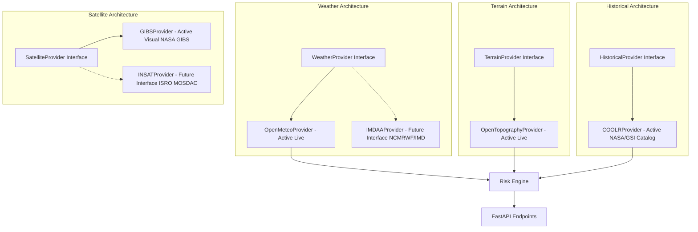

# GeoShield — AI Landslide & Meteorological Early Warning Platform

> **An operational, explainable environmental risk intelligence platform integrating real-time meteorology (Open-Meteo), Digital Elevation Models (OpenTopography/SRTM), NASA historical landslide inventories (COOLR), NASA satellite imagery (GIBS), LightGBM machine learning, and transparent heuristic baselines.**

---

## 1. Executive Summary & Problem Statement

Hilly and mountainous terrains—particularly in the Indian Subcontinent (Western Ghats, Northeast Region/NER, and the Himalayas)—face severe recurrent risks from rainfall-induced landslides and debris flows. These events claim lives, devastate transportation corridors, and sever civil infrastructure.

**GeoShield** addresses this challenge through a multi-tier risk architecture that delivers:
1. **Real-time environmental telemetry aggregation** (antecedent 24h & 72h precipitation, soil moisture, slope gradient, elevation, and historical spatial event density).
2. **Dual-engine risk evaluation**: A trained **LightGBM Gradient Boosting Model** paired with a transparent **Physics-Informed Rule Baseline**.
3. **Interactive spatial risk visualization** with **NASA GIBS satellite overlays** and crowdsourced citizen ground reports.
4. **Scripted severe-weather escalation demo** demonstrating system reactivity during rapid convective crisis.

---

## 2. Core Architectural Distinction: Data Provenance & Taxonomy

In compliance with rigorous scientific standards and hackathon evaluation criteria, GeoShield explicitly distinguishes between data streams throughout both backend APIs and UI presentations:

| Dimension | Description | Implementation in GeoShield |
| :--- | :--- | :--- |
| **LIVE DATA** | Real-time observational telemetry retrieved from external APIs. | • **Open-Meteo**: Hourly precipitation sums, surface soil moisture ($m^3/m^3 \to \%$), humidity.<br>• **OpenTopography / DEM**: Real terrain elevation and local gradient.<br>• **NASA COOLR**: Historical landslide event clustering within 40 km radius. |
| **DEMO DATA** | Scripted simulated meteorological escalation. **Never mixed with live feeds.** | • Step-by-step severe weather simulation (Moisture $\uparrow \to$ Instability $\uparrow \to$ Precipitation $\uparrow \to$ High Alert).<br>• Highlighted with prominent warning banners, `DEMO SCENARIO` metadata tags, and watermarked UI components. |
| **MODEL OUTPUT** | Probabilistic inference generated by the trained LightGBM classifier. | • Expressed strictly as **estimated risk probability** (e.g., `42.5% model probability`).<br>• **Never** claimed as deterministic certainty. |
| **RULE-BASED BASELINE** | Transparent, physics-informed empirical heuristic benchmark. | • Direct linear-weighted formula combining antecedent rainfall saturation, soil moisture, and slope angle.<br>• Displayed side-by-side with ML output to ensure complete explainability. |

---

## 3. Future Data Architecture (Section 15 Provider Interfaces)

The platform adheres to an abstract provider design pattern (`app/providers/base.py`), separating active production data streams from future institutional integrations without "fake-implementing" unavailable sources:



- **Weather**:
  - `OpenMeteoProvider` *(Current)*: Live global high-resolution forecasts without API key lock-in.
  - `IMDAAProvider` *(Future interface)*: Reserved for National Centre for Medium Range Weather Forecasting (NCMRWF) & IMD 12 km reanalysis data assimilation.
- **Terrain**:
  - `OpenTopographyProvider` *(Current)*: Queries Digital Elevation Models (DEM) and computes local slope gradient $\theta = \arctan(\sqrt{dz/dx^2 + dz/dy^2})$.
- **Historical**:
  - `COOLRProvider` *(Current)*: Queries NASA Cooperative Open Online Landslide Repository (COOLR) and Geological Survey of India (GSI) catalogs.
- **Satellite**:
  - `GIBSProvider` *(Current)*: Delivers NASA Global Imagery Browse Services (MODIS Terra True Color, GPM IMERG Precipitation overlays).
  - `INSATProvider` *(Future interface)*: Outlined for ISRO INSAT-3D/3DR quantitative Thermal IR and Water Vapor channel feature extraction.

---

## 4. Machine Learning & Rule-Based Risk Engine

### 4.1 Features Used
The risk model accepts six normalized geophysical features:
1. `rainfall_24h`: Cumulative precipitation over the past 24 hours (mm).
2. `rainfall_72h`: Cumulative antecedent precipitation over 72 hours (mm).
3. `soil_moisture`: Surface volumetric soil moisture saturation (0–100%).
4. `slope`: Terrain inclination angle (0–90°).
5. `elevation`: Surface elevation above sea level (meters).
6. `historical_landslide_count`: Number of recorded historical incidents in a 40 km radius.

### 4.2 Transparent Rule-Based Baseline Formula
$$\text{Baseline Risk} = 0.35 \times \min\left(1, \frac{R_{24}}{300}\right) + 0.15 \times \min\left(1, \frac{R_{72}}{500}\right) + 0.20 \times \frac{SM}{100} + 0.20 \times \min\left(1, \frac{\text{Slope}}{60}\right) + 0.10 \times \min\left(1, \frac{\text{History}}{10}\right)$$

### 4.3 Risk Classification & Alert Thresholds
- **0.00 – 0.24 (Low)**: Green (`#10b981`) — Standard situational monitoring.
- **0.25 – 0.49 (Moderate)**: Yellow (`#f59e0b`) — Elevated saturation, maintain roadside vigilance.
- **0.50 – 0.74 (High)**: Orange (`#f97316`) — Slope vulnerability alert, avoid steep corridors.
- **0.75 – 1.00 (Critical)**: Red (`#ef4444`) — Immediate evacuation advisory for talus and slope footings.

### 4.4 Live Retraining & Governance
The LightGBM model can be retrained on-demand via the dashboard UI or API (`POST /api/model/retrain`), adjusting sample size, learning rate, tree depth, and estimators with immediate hot-reload into active memory.

---

## 5. Demo Mode: Scripted Severe-Weather Escalation (Section 18)

When toggled via the dashboard, GeoShield isolates live API queries and runs a 5-stage scripted scenario representing an extreme monsoonal downpour in a vulnerable hill corridor (calibrated to the Wayanad escarpment profile):

1. **Stage 1 (Ambient)**: Soil Moisture 28%, Rain 0mm, Slope 36.5° $\to$ **Low Risk (0.1%)**.
2. **Stage 2 (Moisture $\uparrow$)**: Inflow of tropical low pressure, Moisture 62%, Rain 32mm $\to$ **Moderate Risk (38%)**.
3. **Stage 3 (Instability $\uparrow$)**: Cloudburst downpour, Moisture 84%, Rain 98mm/24h, 165mm/72h $\to$ **High Risk (68%)**.
4. **Stage 4 (Deluge $\uparrow$)**: Torrential rainfall, Moisture 94%, Rain 195mm/24h, 310mm/72h $\to$ **High Risk (86%)**.
5. **Stage 5 (HIGH ALERT)**: Soil liquefaction threshold, Moisture 100%, Rain 285mm/24h, 460mm/72h $\to$ **Critical Risk (98.2%) $\to$ HIGH ALERT EVACUATION**.

> [!IMPORTANT]
> The demo scenario clearly displays `DEMO SCENARIO` and an orange banner to ensure simulation values are never confused with live operational feeds.

---

## 6. Citizen Early Warning Hazard Reports (Section 14 & 16)

Crowdsourcing ground anomalies provides hyper-local early indicators before broad remote sensing picks them up.
- **Report Types**: Slope tension cracks, muddy water seepage, rockfall, minor mudslides, blocked mountain culverts.
- **Persistence**: Stored in SQLite via SQLAlchemy async ORM.
- **Interactive Map**: Displayed as color-coded pins on the Leaflet map with detailed triage cards.

---

## 7. Security & API Key Governance (Section 17)

- **API Keys**: Configured strictly in `backend/.env`, never exposed or bundled in frontend client code.
- **Input Validation**: Coordinates are validated via Pydantic validators (`latitude` $\in [-90, 90]$, `longitude` $\in [-180, 180]$).
- **Error Handling**: Malformed coordinates or invalid payloads reject immediately with explicit HTTP `400` or `422` error messages.
- **Network Resilience**: When an external API times out or fails (e.g. expired SSL certificate or unreachable DEM server), the system engages a conservative regional geomorphological fallback labeled unambiguously (`is_fallback=True`).

---

## 8. Deployment Architecture (Section 16)

### 8.1 Backend $\to$ Render
- **Root Directory**: `backend`
- **Build Command**: `pip install -r requirements.txt`
- **Start Command**: `uvicorn main:app --host 0.0.0.0 --port $PORT`
- **Environment Variables**:
  - `PORT=10000`
  - `ALLOWED_ORIGINS=https://*.vercel.app,http://localhost:5173`
  - `DATABASE_URL=sqlite+aiosqlite:///./landslide_risk.db`

> [!NOTE]
> **Known Render Free-Tier Limitation**: Render's free web service tier operates on an ephemeral filesystem. SQLite database records (citizen reports and assessment logs) will reset upon service redeploy or container restart. This is fully acceptable for hackathon demonstrations; production migration would switch `DATABASE_URL` to a managed PostgreSQL instance.

### 8.2 Frontend $\to$ Vercel
- **Root Directory**: `frontend`
- **Framework**: Vite
- **Build Command**: `npm run build`
- **Output Directory**: `dist`
- **Environment Variables**:
  - `VITE_API_URL=https://your-backend.onrender.com` (points to the Render backend)
- All client network requests route through the centralized `API_BASE` constant in `frontend/src/api.js`.

---

## 9. Local Installation & Quickstart

### Prerequisites
- Python 3.10+ (Tested on Python 3.14)
- (Optional for standalone frontend editing) Node.js 18+

### Instant Local Launch (Single Server Mode)
The FastAPI backend serves the complete interactive frontend directly out-of-the-box:

```bash
# 1. Navigate to backend
cd backend

# 2. Install dependencies
pip install -r requirements.txt

# 3. Launch application
python -m uvicorn main:app --host 127.0.0.1 --port 8000 --reload
```
Open **`http://127.0.0.1:8000/`** in your browser.

Or use the root launcher:
```bash
python start_server.py
```

### Running Test Verification Suite
Run the automated test suite testing valid/invalid coordinates, fallback behaviors, demo escalations, reports, and governance:
```bash
cd backend
python test_suite.py
```

---

## 10. Honest Disclosures & Known Scope Framing (Section 19 & 21)

Hackathon projects are judged on intellectual honesty and technical execution:

1. **Real Ground-Truth Training Data**: The LightGBM classifier is trained on **1,068 verified samples** based on **267 real GPS landslide ground-truth coordinates** from the catastrophic August 2018 Western Ghats (Kodagu/Wayanad region) storm event, paired with actual **ERA5 reanalysis precipitation and soil moisture records** from Open-Meteo Historical Archive, alongside real dry-season and lowland non-landslide controls.
2. **Probabilistic Nature**: Model outputs are relative risk estimates derived from real environmental inputs, not deterministic 100% disaster forecasts.
3. **NASA GIBS Resolution**: NASA GIBS MODIS tiles operate at Level 9 resolution (~250m ground sampling distance), suitable for regional weather and visual context rather than hyper-local parcel-level slope inspection.
4. **SQLite Ephemeral Storage**: Documented above for Render free-tier deployment.
